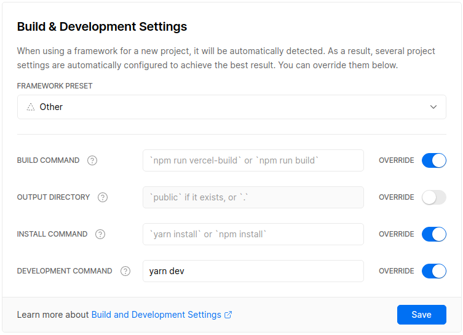

# [WAPES BAL System v3](https://bal.wapesleague.com/)

> An application to create your legend for the [WAPES League community](https://www.wapesleague.com/).

## Requirements

- A [Google Service Account](https://cloud.google.com/iam/docs/service-accounts) with granted permissions to read the [WAPES Google Sheet](https://docs.google.com/spreadsheets/d/1c89tdesdBy3P6qpY-5jmuiAIUX_sB44B4GyhpXFKYD8)
- A free account on [Vercel](https://vercel.com/)
- [Node.js](https://nodejs.org/en/) 16 or 18
- [Git](https://git-scm.com/)
- [Yarn v1](https://classic.yarnpkg.com/lang/en/)

## Project Structure

    📦wapes-bal-system
     ┣ 📂api
     ┃ ┗ 📜bal.js --> (Nodejs Serverless Function)
     ┣ 📂config
     ┃ ┗ 📜params.js --> (Positions and styles parameters)
     ┣ 📂data --> (Contains generated data and timestamp)
     ┣ 📂google-sheet
     ┃ ┣ 📜Sheet-stats.js
     ┃ ┣ 📜constants.js
     ┃ ┗ 📜sheet-service.js --> (Fetch and parse data from Google Sheet API)
     ┣ 📂public --> (Contains distributables compiled assets for Frontend)
     ┣ 📂scripts
     ┃ ┣ 📜generate-data.js --> (Generate stats data needed by Serverless Function)
     ┃ ┗ 📜set-csp.js --> (Write Content Security Policy hashes to vercel.json file)
     ┣ 📂serverless --> (Business Logic of Serverless Functions)
     ┃ ┣ 📜Bal.js --> (Calculate bal players stats)
     ┃ ┗ 📜MKII-indexes.js
     ┣ 📂src --> (Contains Frontend sources)
     ┃ ┣ 📂js
     ┃ ┣ 📂scss
     ┃ ┗ 📜index.html
     ┣ 📂static --> (Contains static assets to be served in Frontend)
     ┣ 📜.env.sample
     ┣ 📜.eslintrc.js
     ┣ 📜.gitignore
     ┣ 📜.nvmrc
     ┣ 📜.prettierrc.json
     ┣ 📜.vercelignore
     ┣ 📜CHANGELOG.md
     ┣ 📜LICENSE
     ┣ 📜README.md
     ┣ 📜babel.config.js
     ┣ 📜package.json
     ┣ 📜postcss-csp-style-src-hash.js --> (postcss plugin to generate CSP styles hashes)
     ┣ 📜postcss.config.js
     ┣ 📜rollup.config.js
     ┣ 📜vercel.dev.json
     ┣ 📜vercel.json
     ┗ 📜yarn.lock

## Installing

- Clone the repository and install the dependencies:

  ```bash
  git clone https://github.com/freddy38510/wapes-bal-system && cd wapes-bal-system

  yarn
  ```

- Fill `.env.sample` file with your [Google service account keys](https://cloud.google.com/iam/docs/creating-managing-service-account-keys) and rename it to `.env`.

- Link and setup your Vercel project by overwriting settings as follows:

  ```console
  $ yarn vercel link
  Vercel CLI 23.1.3-canary.72 — https://vercel.com/feedback
  > No existing credentials found. Please log in:
  > Log in to Vercel github
  > Success! GitHub authentication complete for freddyescobar@hotmail.fr
  ? Set up “~/wapes-bal-system”? [Y/n] y
  ? Which scope should contain your project? freddy38510
  ? What’s your project’s name? wapes-bal-system
  ? In which directory is your code located? ./
  No framework detected. Default Project Settings:
  - Build Command: `npm run vercel-build` or `npm run build`
  - Output Directory: `public` if it exists, or `.`
  - Development Command: None
  ? Want to override the settings? [y/N] y
  ? Which settings would you like to overwrite (select multiple)? Build Command, Development Command
  ? What's your Build Command?
  ? What's your Development Command? yarn dev
  ✅ Linked to freddy38510/wapes-bal-system (created .vercel)
  ```

  Settings:

  - Build Command: press <kbd>enter</kbd>
  - Development Command: `yarn dev`

  You can also edit your project settings using the Vercel dashboard:

  

## Developing

- Fetch and store the data from the WAPES Google Sheet to json files:

  ```bash
  yarn build:data
  ```

- Build the application and start a local webserver which replicate the Vercel deployment environment:

  ```bash
  yarn start
  ```

- Open http://localhost:3000 and take benefit from live reloading during development.

## Deploying (preview/production)

- Generate fresh data and build the application for production with [Content Security Policy](https://developer.mozilla.org/fr/docs/Web/HTTP/CSP):

  ```bash
  yarn build
  ```

- Deploy it to Vercel:

  - Preview deployment

    ```bash
    yarn vercel
    ```

  - Production deployment

    ```bash
    yarn vercel --prod
    ```
